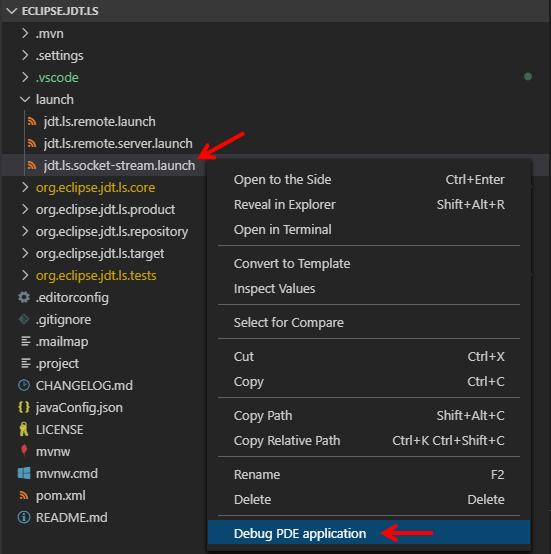

# How to contribute

Contributions are essential for keeping this extension great.
We try to keep it as easy as possible to contribute changes and we are
open to suggestions for making it even easier.
There are only a few guidelines that we need contributors to follow.

## vscode-java vs eclipse.jdt.ls

vscode-java is a Visual Studio Code extension that uses a language server for its Java language
smartness. Usually vscode-java features depend on the [Eclipse &trade; JDT Language Server](https://github.com/eclipse/eclipse.jdt.ls),
(a.k.a. eclipse.jdt.ls) and the contributions should be coordinated between the two repositories.

#

## Background Info

For the whole language server to get up and running it requires
two parts.

 **A)** The Client Side (this repo): [VSCode Java](https://github.com/redhat-developer/vscode-java)

**B)** The Server Side: [JDT LS](https://github.com/eclipse/eclipse.jdt.ls)

#

## Complete Setup Guide

The following will be a start to finish guide to get the entire language server up and running.

#

## **A)** Client Side Setup

1. Install the required software:
   * latest [Visual Studio Code](https://code.visualstudio.com/)
   * [Node.js](https://nodejs.org/) v18.17.1 (with npm 9.6.7) or higher
2. Fork and clone [this repository](https://github.com/redhat-developer/vscode-java)

  	Keep in mind the final directories will look like:

	```
	PROJECT_FOLDER/
		     |
	  	     |--- vscode-java/
		     |--- eclipse.jdt.ls/

	```


3. `cd vscode-java`
4. Install the dependencies:

	```bash
	$ npm install
	```
5. (**\*Optional**) Build a platform specific JRE:

	```bash
	$ npx gulp download_jre
	```
	You can also use the options `--target` and `--javaVersion` to build the specified JRE version for the specified target architecture.

#

## **B)** Server Side Setup
This assumes that you are starting on the `vscode-java` directory

1. `cd ..`
2. Fork and clone the [eclipse.jdt.ls](https://github.com/eclipse/eclipse.jdt.ls) repository

	Ensure the directory looks like:
	```
	PROJECT_FOLDER/
		     |
	  	     |--- vscode-java/
		     |--- eclipse.jdt.ls/

	```
3. Build server

	```bash
	$ cd ./vscode-java
	$ npm run build
	```
If the eclipse.jdt.ls directory is not found as a sibling directory (see the desired hierarchy in the previous step), a snapshot of the language server will be downloaded instead.

To build the server using only the local eclipse.jdt.ls repository, use `npm run build-server`.

**\*Optional:**
You can run faster server builds during development by calling `npm run fast-build-server` script instead, this will build server binaries that are required by your host OS only. You can also use `npm run watch-server` which will build and place them on the extension for Java changes. These commands run Maven in offline mode, so you might need to run `build-server` at least once, to fetch all the dependencies.

This will build and place the binaries under the `server` folder. Alternately you can download and use the latest snapshot build from [Eclipse &trade; JDT Language Server](https://github.com/eclipse/eclipse.jdt.ls) project with the following

```bash
$ cd ../vscode-java
$ ./node_modules/.bin/gulp download_server
```
### Setting up the JDT Language Server
Below are the details about how to set up the JDT Language Server in different IDEs. **Notice**: You only need set up it once in any of your preferred IDE.

### B-1) Setting up the JDT Language Server in VS Code
1) Please install [Eclipse PDE support](https://marketplace.visualstudio.com/items?itemName=yaozheng.vscode-pde) extension in your VS Code first. The PDE extension's home page provides more usage details about _Reload Target Platform_, _Run JUnit Plug-in Test_, _Run Eclipse Application_.

2) Open VS Code on the `eclipse.jdt.ls` folder. The PDE extension will work with Java extension together to automatically load the eclipse.jdt.ls project. Check the status of the language tools on the lower right corner. It should show ready (thumbs up) as the image below.
  

### B-2) Setting up the JDT Language Server in Eclipse
1) In Eclipse, import a maven project:

    

    

    Select the `eclipse.jdt.ls` folder, then click yes/accept to all
following prompts:

    

2) Now we need to use Tycho to download the dependencies,
this will get rid of the errors.

	At the top right arrow it will say `Set Target Platform`, select that and continue.

	

	After it will change to `Reload Target Platform` select that:

    

3) Wait till the bottom right is done loading:

    

	once 100%:


    The errors should now be gone.

#
# Running Everything

## **C)** Run with a remote JDT language server

While developing the language server and the extension, you don't need to deploy the server every time to try out changes. Instead you can run the language server out of its Eclipse workspace. Currently we provide two kinds of connection modes between the extension and the language server.
## **C-1)** The extension opens the connection first, and waits the language server to connect to it.
### a) _Launch Extension - Client Side_

1. Open VSCode on the `vscode-java` folder

2. In the debug viewlet, run the launch _Launch Extension - Remote Server_


3. The extension will open a socket on port 3333 and will wait for the JDT language server to connect

### b) _Launch Debug Server - Server Side_

- With the client side **(vscode-java) running**, you can start the remote server in your preferred IDE.
  - Start the remote server via VS Code.
    

  - Start the remote server via Eclipse.
    

- In the debug console of VSCode you can see if the connection was successful.
- When the server is running breakpoints can be reached and hot code replace can be used to make fixes without restarting the server.
- You can modify `launch.json` to use a different port:
    - Modify `JDTLS_SERVER_PORT` to specify the port the JDT LS server should connect to.

## C-2) The language server opens the connection first, and waits the extension to connect to it.
- Start the language server via `jdt.ls.socket-stream` launch configuration in VS Code or Eclipse
  

- Start the extension via _Launch Extension - JDTLS Client_ in VS Code
- You can modify `launch.json` to use a different port:
    - Modify `JDTLS_CLIENT_PORT` to specify the port VS Code should connect to.

## C-3) Set location to a local copy of JDT-LS

This approach is mainly targeting developers of JDT-LS who want to test their changes in VSCode without having to rebuild vscode-java and to deal with the npm and vsix toolchains.

- Make sure a recent snapshot of vscode-java is installed in your VSCode instance (as of vscode-java 1.20.0)
- (Optionally) clear the workspace state: `$ rm -r $HOME/.config/Code/User/workspaceStorage/0123456789abcdef01234567890abcdef/redhat.java/jdt_ws`
- Start VSCode with the `JDT_LS_PATH` environment variable set to the local copy of JDT-LS you want to try: `$ JDT_LS_PATH=$HOME/git/eclipse.jdt.ls/org.eclipse.jdt.ls.product/target/repository code`

Most other options such as `DEBUG_VSCODE_JAVA` are still usable with this approach.

## Sideloading

You can create a binary that you can sideload to your VS Code installation.

1. Fork and clone this repository
2. `cd vscode-java`
3. Install the dependencies:

	```bash
	$ npm install
	```
4. Optionally, follow the instruction to build the server.
5. See documentation on [extension installation](https://github.com/microsoft/vscode-docs/blob/master/api/working-with-extensions/publishing-extension.md)
on ways to sideload or share.

# Reporting issues
If you encounter a problem and know it is caused by eclipse.jdt.ls, then please open a bug report over [there](https://github.com/eclipse/eclipse.jdt.ls/issues).
In doubt, you can report issues in the [vscode-java issue tracker](https://github.com/redhat-developer/vscode-java/issues).

Try to collect as much information as you can to describe the issue and help us reproduce the problem. Head over to the [troubleshooting page](https://github.com/redhat-developer/vscode-java/wiki/Troubleshooting#enable-logging) to see how to collect useful logging information.

### Certificate of Origin

By contributing to this project you agree to the Developer Certificate of
Origin (DCO). This document was created by the Linux Kernel community and is a
simple statement that you, as a contributor, have the legal right to make the
contribution. See the [DCO](DCO) file for details.
