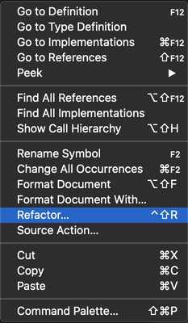

# Java Refactoring

## Table of Content
- [Introduction](#introduction)
- [Assign to variable](#assign-to-variable)
- [Change modifiers to final](#change-modifiers-to-final)
- [Convert anonymous to nested class](#convert-anonymous-to-nested-class)
- [Convert to anonymous class creation](#convert-to-anonymous-class-creation)
- [Convert to enhanced for loop](#convert-to-enhanced-for-loop)
- [Convert to lambda expression](#convert-to-lambda-expression)
- [Convert to static import](#convert-to-static-import)
- Extract refactorings
  - [Extract to constant](#extract-to-constant)
  - [Extract to field](#extract-to-field)
  - [Extract to method](#extract-to-method)
  - [Extract to local variable](#extract-to-local-variable)
- Inline refactorings
  - [Inline constant](#inline-constant)
  - [Inline local variable](#inline-local-variable)
  - [Inline method](#inline-method)
- [Introduce Parameter](#introduce-parameter)
- Invert boolean
  - [Invert conditions](#invert-conditions)
  - [Invert local variable](#invert-local-variable)
- [Move](#move)
- [Rename](#rename)
- Type change
  - [Change resolved type to var type](#change-resolved-type-to-var-type)
  - [Change var type to resolved type](#change-var-type-to-resolved-type)

---

## Introduction

The goal of the Java program refactoring is to make system-wide code changes without affecting the behavior of the program. The **Java Language Support for __VSCODE_ENV_APPNAME_PLACEHOLDER__** provides assistance in easily refactoring code.

### Invoke refactoring
Refactoring commands are available from the context menu of the editor. Select the element you want to refactor, right-click to open the context menu and choose `Refactor...`:



Then you will see all the available refactoring options.

---

## Assign to variable
Assigns an expression to a local variable or a field.

### Example
#### Before

```java
Arrays.asList("apple", "lemon", "banana");
```
#### After
```java
List<String> fruits = Arrays.asList("apple", "lemon", "banana");
```

---

## Change modifiers to final
Adds `final` modifier to all the variables and parameters in the current source file.

### Example
#### Before

```java
public class Clazz {
  public void method(int value) {
    boolean notValid = value > 5;
    if (notValid) {
      // do something
    }
  }
}
```
#### After
```java
public class Clazz {
  public void method(final int value) {
    final boolean notValid = value > 5;
    if (notValid) {
      // do something
    }
  }
}
```

---

## Convert anonymous to nested class
Converts an anonymous inner class to a member class.

### Example
Let's convert the anonymous class `Interface(){...}` to a member of the class `Clazz`.
#### Before

```java
public class Clazz {
  public Interface method() {
    final boolean isValid = true;
    return new Interface() {
      public boolean isValid() {
        return isValid;
      }
    };
  }
}
```
#### After
```java
public class Clazz {
  private final class MyInterface extends Interface {
    private final boolean isValid;

    private MyInterface(boolean isValid) {
      this.isValid = isValid;
    }

    public boolean isValid() {
      return isValid;
    }
  }

  public Interface method() {
    final boolean isValid = true;
    return new MyInterface(isValid);
  }
}
```

---

## Convert to anonymous class creation
Converts lambda expression to anonymous class creation.

### Example
The variable `runnable` is assigned with a lambda expression. Let's convert it to an anonymous class creation.
#### Before

```java
public void method() {
  Runnable runnable = () -> {
    // do something
  };
}
```
#### After
```java
public void method() {
  Runnable runnable = new Runnable() {
    @Override
    public void run() {
      // do something
    }
  };
}
```

> Also see: [Convert to lambda expression](#convert-to-lambda-expression)

---

## Convert to enhanced for loop
Converts the simple `for` loop to `for-each` style.

### Example
#### Before

```java
public void order(String[] books) {
  for (int i = 0; i < books.length; i++) {
    // do something
  }
}
```
#### After
```java
public void order(String[] books) {
  for (String book : books) {
    // do something
  }
}
```

---

## Convert to lambda expression
Converts an anonymous class creation to the lambda expression.

### Example
Let's convert the anonymous class `Runnable(){...}` to a lamda expression.
#### Before

```java
public void method() {
  Runnable runnable = new Runnable(){
    @Override
    public void run() {
      // do something
    }
  };
}
```
#### After
```java
public void method() {
    Runnable runnable = () -> {
      // do something
    };
  }
```
> Also see: [Convert to anonymous class creation](#convert-to-anonymous-class-creation)

---

## Convert to static import
Converts the field or method to static import.

### Example
Let's transform the `Assert.assertEquals()` invocation to a static import.
#### Before

```java
import org.junit.Assert;
...
public void test() {
  Assert.assertEquals(expected, actual);
}
```
#### After
```java
import static org.junit.Assert.assertEquals;
...
public void test() {
  assertEquals(expected, actual);
}
```

---

## Extract to constant
Creates a static final field from the selected expression and substitutes a field reference, then rewrites other places where the same expression occurs.

### Examples
Let's extract the value of π: `3.14` to a constant.
#### Before

```java
public double getArea(double r) {
  return 3.14 * r * r;
}
```
#### After
```java
private static final double PI = 3.14;

public double getArea(double r) {
  return PI * r * r;
}
```

> Also see: [Inline constant](#inline-constant)

---

## Extract to field
Declares a new field and initializes it with the selected expression. The original expression is replaced with the usage of the field.

### Examples
Let's extract the variable `area` to a field of the class `Square`.
#### Before

```java
class Square {
  public void calculateArea() {
    int height = 1;
    int width = 2;
    int area = height * width;
  }
}
```
#### After
```java
class Square {
  private int area;

  public void calculateArea() {
    int height = 1;
    int width = 2;
    area = height * width;
  }
}
```

---

## Extract to method
Creates a new method containing the statements or expressions currently selected and replaces the selection with a reference to the new method. This feature is useful for cleaning up lengthy, cluttered, or overly-complicated methods.

### Examples
Let's extract the expression `height * width` to a new method.
#### Before

```java
public void method() {
  int height = 1;
  int width = 2;
  int area = height * width;
}
```
#### After
```java
public void method() {
  int height = 1;
  int width = 2;
  int area = getArea(height, width);
}

private int getArea(int height, int width) {
  return height * width;
}
```

> Also see: [Inline method](#inline-method)

---

## Extract to local variable
Creates a new variable assigned to the expression currently selected and replaces the selection with a reference to the new variable.

### Examples
Let's extract the expression `platform.equalsIgnoreCase("MAC")` to a new variable.
#### Before

```java
public void method() {
  if (platform.equalsIgnoreCase("MAC")) {
    // do something
  }
}
```
#### After
```java
public void method() {
  boolean isMac = platform.equalsIgnoreCase("MAC");
  if (isMac) {
    // do something
  }
}
```

> Also see: [Inline local variable](#inline-local-variable)

---

## Inline constant
Replaces a constant reference with its defined value.

### Examples
Let's replace the constant `PI` to its defined value: `3.14`.
#### Before

```java
private static final double PI = 3.14;

public double getArea(double r) {
  return PI * r * r;
}
```

#### After
```java
private static final double PI = 3.14;

public double getArea(double r) {
  return 3.14 * r * r;
}
```

> Also see: [Extract to constant](#extract-to-constant)

---

## Inline local variable
Replaces redundant variable usage with its initializer.

### Examples
Let's replace the variable `isMac` directly to the boolean expression.
#### Before

```java
public void method() {
  boolean isMac = platform.equalsIgnoreCase("MAC");
  if (isMac) {
    // do something
  }
}
```
#### After
```java
public void method() {
  if (platform.equalsIgnoreCase("MAC")) {
    // do something
  }
}
```

> Also see: [Extract to local variable](#extract-to-local-variable)

---

## Inline method
Replaces calls to the method with the method’s body.

### Example
Let's replace the method `getArea(int height, int width)` directly to the expression `height * width`.
#### Before

```java
public void method() {
  int height = 1;
  int width = 2;
  int area = getArea(height, width);
}

private int getArea(int height, int width) {
  return height * width;
}
```
#### After
```java
public void method() {
  int height = 1;
  int width = 2;
  int area = height * width;
}
```

> Also see: [Extract to method](#extract-to-method)

---

## Introduce Parameter
Replaces an expression with a reference to a new method parameter, and updates all callers of the method to pass the expression as the value of that parameter.

### Example
Let's introduce a new parameter for the method `public void addUser()`.

#### Before
```java
public void buildRegistry() {
  addUser();
}

public void addUser() {
  fUsers.add("Administrator");
}
```
#### After
```java
public void buildRegistry() {
  addUser("Administrator");
}

public void addUser(String name) {
  fUsers.add(name);
}
```

## Invert conditions
Inverts the boolean expression in the conditions.

### Example
Let's invert the boolean expression in the if statement.

#### Before
```java
public void method(int value) {
  if (value > 5 && value < 15) {
    // do something
  }
}
```
#### After
```java
public void method(int value) {
  if (value <= 5 || value >= 15) {
    // do something
  }
}
```

---

## Invert local variable
Inverts the local boolean variable.

### Example
Let's invert the variable `valid`.

#### Before
```java
public void method(int value) {
  boolean valid = value > 5 && value < 15;
}
```
#### After
```java
public void method(int value) {
  boolean notValid = value <= 5 || value >= 15;
}
```

---

## Move
Moves the selected elements and corrects all references to the elements (also in other files). Available actions are:
- Move class to another package
- Move static or instance method to another class
- Move inner class to a new file

### Examples
Let's move the static method `print()` from class `Office` to class `Printer`.
#### Before

```java
public class Office {
  public static void main(String[] args) {
    print();
  }

  public static void print() {
    System.out.println("This is printer");
  }

  static class Printer { }
}
```

#### After
```java
public class Office {
  public static void main(String[] args) {
    Printer.print();
  }

  static class Printer {
    public static void print() {
      System.out.println("This is printer");
    }
  }
}
```

---

## Rename

**_Default shortcut:_ <kbd>F2</kbd>**

Renames the selected element and corrects all references to the elements (also in other files).

### Examples
Let's rename the class `Foo` to `Bar`
#### Before

```java
public class Foo {
  // ...
}

public void myMethod() {
  Foo myClass = new Foo();
}
```
#### After
```java
public class Bar {
  // ...
}

public void myMethod() {
  Bar myClass = new Bar();
}
```

---

## Change resolved type to var type
Uses `var` to declare local variables.

### Examples
#### Before

```java
String s = "";
```
#### After
```java
var s = "";
```

> Also see: [Change var type to resolved type](#change-var-type-to-resolved-type)

---

## Change var type to resolved type
Uses the resolved type to declare local variables.

### Examples
#### Before

```java
var s = "";
```
#### After
```java
String s = "";
```

> Also see: [Change resolved type to var type](#change-resolved-type-to-var-type)